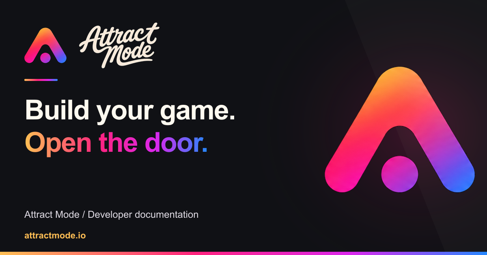

# Attract Mode browser-game kit



**Keep building your game. Give players an account they can bring with them.**

A small, playable browser game that shows how to connect an approved third-party game to Attract Mode using OpenID Connect. Run it locally without an account or API key, then adapt the backend to your game. Includes a portable coding-agent skill and an optional read-only documentation MCP.

[Developer docs](https://attractmode.io/docs) · [Download ZIP](https://github.com/AttractMode-io/browser-game-kit/releases/latest/download/attract-mode-browser-game-kit.zip) · [Source](https://github.com/AttractMode-io/browser-game-kit) · [Report a bug](https://github.com/AttractMode-io/browser-game-kit/issues)

Attract Mode is a browser-game discovery platform at [attractmode.io](https://attractmode.io). This repository is its MIT-licensed account-integration reference for browser-game developers. Listing a game and connecting its accounts are separate steps; a listing does not register an OAuth client.

## Get your game onto Attract Mode

Start with the [developer onboarding guide](docs/developer-onboarding.md) to list a game, request account integration or arrange a managed playtest. It includes the complete requirements, review statuses and an email path for developers whose agents cannot use the interactive workspace. Listing does not require installing this kit.

## Play the demo in three commands

Install [Node.js 24 LTS](https://nodejs.org/), then:

```sh
git clone https://github.com/AttractMode-io/browser-game-kit.git
cd browser-game-kit
npm ci --ignore-scripts && npm run dev
```

Open **http://127.0.0.1:3000**. Click targets, select **Simulate sign-in (offline)**, then sign out. The banner labels this as a simulation. It uses a local test identity, makes no real account and sends no sign-in requests to Attract Mode. Your score stays in the browser tab.

**Using the ZIP?** Extract it, open a terminal in the extracted folder containing `package.json`, then run `npm ci --ignore-scripts` and `npm run dev`. You do not need Git. Dependencies download during installation; the default demo runs offline afterward. Stop with Ctrl+C. If port 3000 is occupied, set `PORT=3001` in your shell before starting.

Run `npm run doctor` for a redacted setup report. Add `-- --online` to check the public capability manifest. [Diagnostic codes and boundaries](docs/diagnostics.md).

A runnable Three.js scene is also at **http://127.0.0.1:3000/examples/threejs**. Its render loop starts without waiting for sign-in.

For a real isolated OAuth protocol test with disposable identities, use the [local Supabase sandbox](docs/local-sandbox.md). It requires Docker; it is separate from the instant offline demo.

## Choose your next step

| You want to… | Start here |
| --- | --- |
| Let a coding agent integrate your existing game | [Agent setup and example prompts](agents/README.md) |
| Add an account panel to an existing Three.js game | [Three.js wiring example](docs/threejs.md) |
| Add an account panel to a Phaser scene | [Phaser wiring example](docs/phaser.md) |
| Keep a static frontend and add an account backend | [Hosting architecture](docs/static-frontend.md) |
| Fix a setup or sign-in problem | [Troubleshooting](docs/troubleshooting.md) |
| Understand how sign-in works | [Account integration](docs/account-integration.md) |
| Connect a real, approved OAuth client | [Go from local demo to real sign-in](docs/go-live.md) |
| Search the integration contract from an MCP client | [Optional local documentation MCP](mcp/README.md) |
| Get your game listed or claim its page | [Listing and review checklist](docs/developer-onboarding.md) |
| Arrange a multiplayer or usability playtest | [Managed playtest request](https://attractmode.io/docs/playtesting) |
| Prepare a request without an interactive browser | [Text template](docs/developer-request-template.txt) · [JSON template](docs/developer-request-template.json) |
| Check what the platform actually exposes | [Capability manifest](mcp/capabilities.json) |

Browser and server entries are separated in [the package boundary guide](docs/package-boundaries.md). The kit is framework-neutral JavaScript. Keep your Three.js, Phaser, React or other game stack. The account adapter runs on a backend; do not paste it into a browser bundle. A static-only game needs a backend-for-frontend before using confidential-client login.

## Use your coding agent

From the kit folder, install the skill into **your game project**:

```sh
node agents/install.mjs codex /absolute/path/to/your-game
# Use claude, cursor or gemini instead of codex for those clients.
```

Then ask:

> Use the Attract Mode integration skill to add optional account sign-in to this game. Preserve our engine and guest play. Start with the offline demo, keep credentials on the backend, and explain what needs registration before a real player can sign in.

The installer only copies the bundled skill into that project's documented skill directory. It does not overwrite existing skills, change global settings, register a client or install an MCP server. Review the files before trusting them.

## What works today

- **Local account-flow demo:** playable example, signed simulated identity, sign-in, session and local sign-out.
- **Reviewed third-party account integration:** authorization code with S256 PKCE, state, nonce and token verification. Live access requires a separately registered client, exact HTTPS callback and player consent.
- **Catalog and community on Attract Mode:** game/studio pages, verified claims, moderated reviews, saves and follows are website features. They are not general-purpose APIs supplied by this kit.
- **Agent tooling:** a versioned integration skill and read-only local docs MCP.

Achievements, shared XP, playtime reporting, cloud saves, payments, subscriptions and revenue sharing are **not third-party APIs in this release**. Do not infer them from an account login or build against guessed endpoints. [The public capability contract](https://attractmode.io/developer-capabilities.json) records the current surface.

Upgrading a connected 0.1.x game? Read [the 0.2 migration guide](docs/migration-0.2.md) before changing player identifiers.

## Security and production boundary

This is a runnable reference implementation, not a production hosting service. The default server binds to loopback and uses memory. A [single-host production adapter](docs/production-storage.md) adds encrypted SQLite TTL storage with atomic one-use consumption; production refuses to start without its configuration. Use a trusted HTTPS proxy, deployment abuse controls and a reviewed account lifecycle. [Read the deployment checklist](docs/go-live.md).

The adapter verifies the issuer, audience, signature, state, nonce and expiry; binds transactions to the initiating browser; rejects replay; and keeps tokens and client secrets server-side. The browser receives an opaque HttpOnly session. Never reuse another game's client registration, bypass third-party consent or merge accounts by email.

## Test it

```sh
npm test
npm run test:agents
# Optional MCP package:
npm --prefix mcp ci --ignore-scripts
npm --prefix mcp test
```

Tests use an actual HTTP demo and signed mock OIDC exchange. They cover invalid callbacks, forged identity, expiry, replay, cross-origin requests, installer boundaries and MCP stdio. These checks do not replace a real registered-client integration pilot.

## Where things live

```text
account-client.mjs   Pinned-issuer OIDC adapter for your backend
demo-handler.mjs     Request/Response routes and demo session store
server.mjs           Loopback development server
mock-account.mjs     Local signed identity simulation, never a real issuer
game.mjs             Tiny guest-play target game
integrations/        Browser account panel and engine lifecycle wiring
skills/              Portable integration skill
agents/              Project-local skill installer
mcp/                 Optional read-only docs tools
```

## Help, releases and contributions

For reproducible kit bugs, [open an issue](https://github.com/AttractMode-io/browser-game-kit/issues). Use the [developer workspace](https://attractmode.io/developers) or **hello@attractmode.io** for reviewed listing, client-registration and managed playtest requests; never include passwords or secret keys in an issue. Report security problems privately using [SECURITY.md](SECURITY.md).

Releases include a named ZIP and SHA-256 checksum. GitHub also provides its normal source archives. Pin a release tag when you want a repeatable integration; `main` may contain newer changes. See [CONTRIBUTING.md](CONTRIBUTING.md) for changes and [CHANGELOG.md](CHANGELOG.md) for releases.

MIT licensed code. Attract Mode names and logo assets remain Attract Mode branding; this kit does not grant a partnership or connected-game badge.
